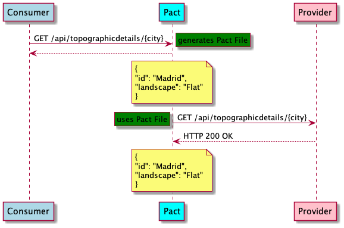

# Modulo Testing. Parte 2: Contract Testing

[Enunciado](../Readme.md)

## Requirements

- Java 17
- Maven 3.5 or higher

## Technologies used

- Java 17
- Spring Boot 2.6.3
- JUnit 5
- [Pact](https://docs.pact.io/)
- [@WebMvcTest](https://docs.spring.io/spring-boot/docs/current/api/org/springframework/boot/test/autoconfigure/web/servlet/WebMvcTest.html)



## Por qué los Unit test no son suficientes?

La clase que contiene un test básico de RestTemplate es [TopoClientTest](./planner/src/test/java/es/codeurjc/mastercloudapps/planner/clients/TopoClientTest.java)

Las pruebas unitarias se escriben y ejecutan de forma aislada de cualquier otro servicio. Cuando escribimos pruebas para el código que se comunica con otros servicios, se basan en la confianza de que se cumplen los contratos. No hay forma de validar que el consumidor y el proveedor puedan comunicarse correctamente.

## Consumer Pact Test

La clase que contiene los test es [TopoServiceApiConsumerPactTest](./planner/src/test/java/es/codeurjc/mastercloudapps/planner/clients/pact/consumer/TopoServiceApiConsumerPactTest.java)

Estas pruebas inician un servidor simulado en un puerto aleatorio que actúa como nuestro servicio de proveedor. Para que esto funcione, actualizamos la URL en TopoClient para que apunte al servidor simulado que Pact proporciona para la prueba.

Ejecutar esta prueba también pasa, pero crea un archivo de pacto que podemos usar para validar nuestras suposiciones en el lado del proveedor.

## Verificar el provider

Tendremos que copiar el archivo de contrato Pact que se produjo a partir de la prueba del consumidor en el módulo Proveedor. Esto nos ayudará a verificar que el proveedor pueda cumplir con los requisitos establecidos en el contrato.

Copie el contrato que se encuentra en `planner/target/pacts/planner_service-topo_service.json` en toposervice/src/test/resources/pacts/planner_service-topo_service.json.

Ahora comencemos a escribir una prueba Pact para validar el contrato del consumidor:

La clase que contiene los test es [TopoServiceApiProviderPactTest](./toposervice/src/test/java/es/codeurjc/mastercloudapps/topo/pact/producer/TopoServiceApiProviderPactTest.java)

Esta es una prueba de Springboot que utiliza Spring para configurar ciertas características de MVC sin requerir todo el contexto de Spring Boot para mantener las pruebas rápidas. Luego configuramos el contexto de prueba usando algunas anotaciones en la clase de prueba que le dice al marco de Pact quién es el proveedor y dónde están los archivos de Pact. También configuramos el `test target` para que apunte al Mock de la aplicación.

La clase que contiene los test usando @WebMvcTest y MockMVC es [TopoServiceApiProviderPactWithMockMvcTest](./toposervice/src/test/java/es/codeurjc/mastercloudapps/topo/pact/producer/TopoServiceApiProviderPactWithMockMvcTest.java)

También puede ejecutar pruebas de pacto contra MockMvc sin necesidad de cargar todo el contexto de la aplicación, lo que lleva tiempo y, a menudo, requiere más configuración adicional (por ejemplo, base de datos). Para ejecutar pruebas ligeras, podemos usar solo @WebMvcTest de Spring y MockMvcTestTarget como `test target` antes de cada prueba.

## Ejecutar los test

Ejecutar los unitarios:

```
$ mvn clean test
```

Ejecutar los de integración:

```
$ mvn clean verify
```


## Commands to generate Pacts in the Consumer side

To generate pacts locally for a specific contract file

```bash
 mvn verify -pl planner
 ```

To publish the pacts in the PactBroker

```bash
docker-compose up -d # To initialize the Pact Broker
mvn pact:publish -pl planner
```

## Commands to verify Pacts in the Producer side

To verify pacts without publishing results

*Remember that the provider must be up and running before making this verification*

```bash
mvn verify -pl toposervice
```

To verify pacts and publish results in the Pact Broker

```bash
docker-compose up -d # To initialize the Pact Broker
mvn verify -Dpact.verifier.publishResults=true -Dpact.provider.version=0.0.1-SNAPSHOT -pl toposervice
```


